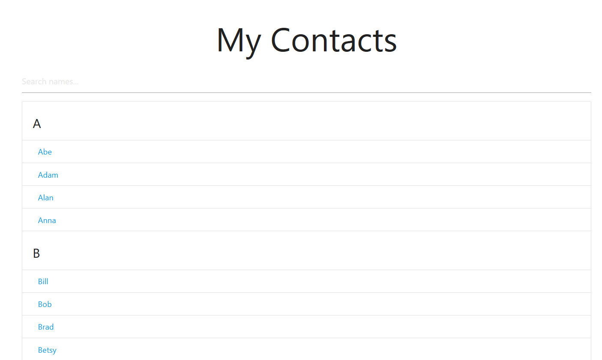
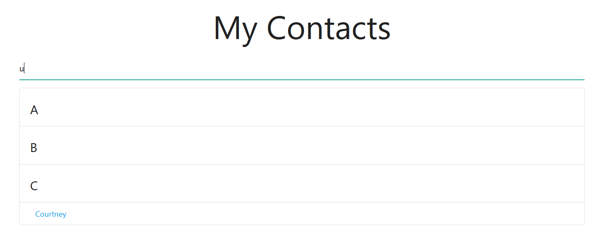
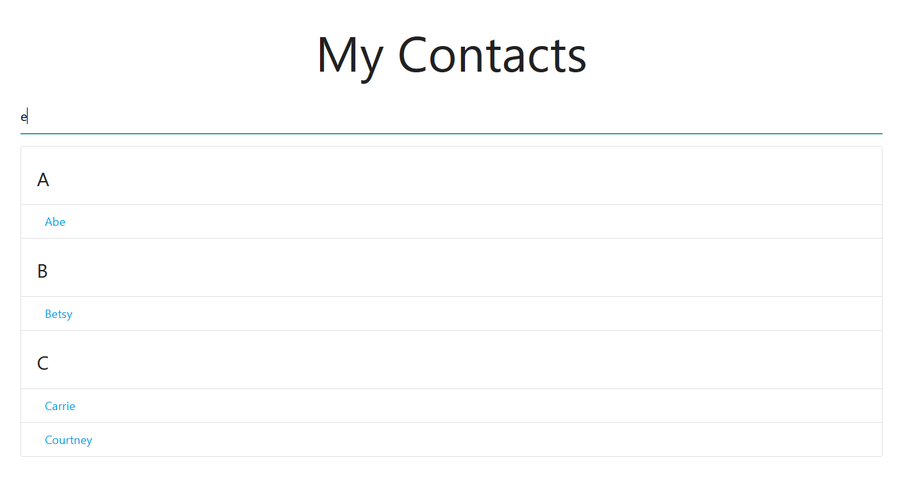

# JS-Filterable-List

JavaScript Filterable List

<!-- Live link to deployed app -->

Repository: https://github.com/Mdudzik92/JS-Filterable-List  
Deployed app: https://mdudzik92.github.io/JS-Filterable-List/

<!-- Technologies used -->

HTML, CSS, Materialize.css, JavaScript

<!-- Explanation of what the app is -->

This is an app in which the user can filter through a list of names by typing in a letter in teh input search bar. The list changes to only show the names which contain the letters which they type so that it's easier/quicker to find who they're looking for in the list.

<!-- Screenshot -->

<!-- License -->

MIT

<!-- Contact information -->

Email: mdudzik92@gmail.com
